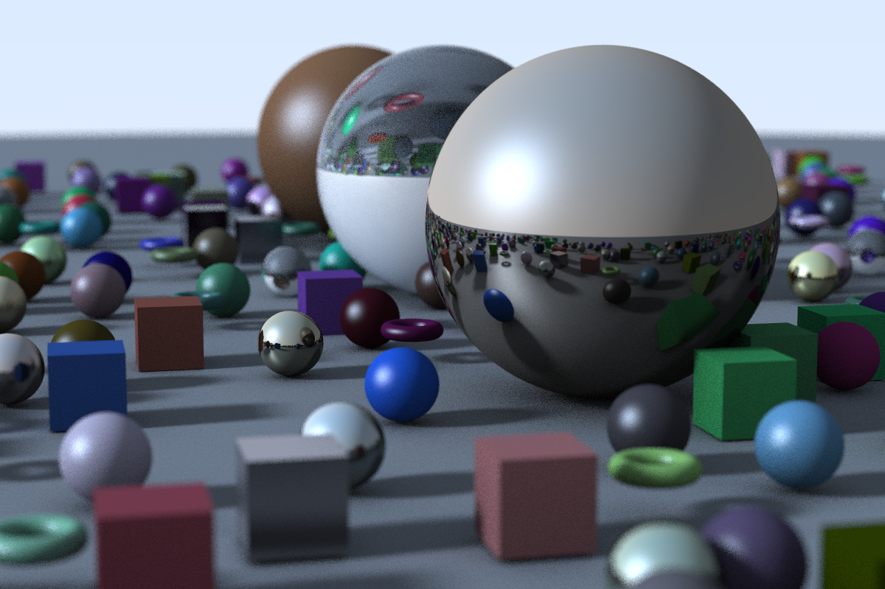

# Raytracer
Raytracer written in C++ based on Peter Shirley's [Ray Tracing in One Weekend](https://raytracing.github.io/books/RayTracingInOneWeekend.html) with additional features such as lights (Blinn-Phong), shadows, and ray marching (torus).

Example Output Image:

